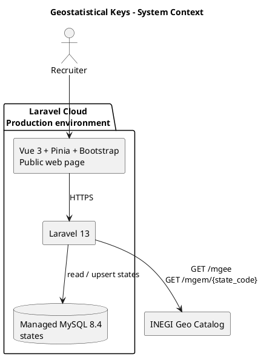
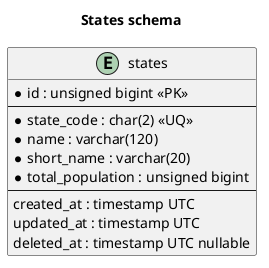
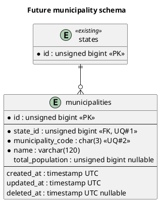
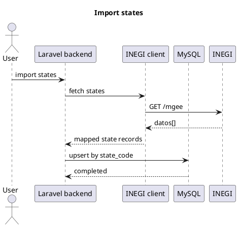
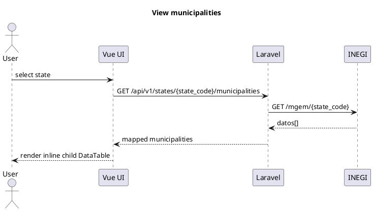

# Architecture

## Context

## Entity relationship diagram

`states` is the only persisted domain table in this version. This diagram is the schema authority.

Both INEGI endpoints return records in `datos`. Map `cve_ent`, `nomgeo`, `nom_abrev`, and `pob_total` to the `states` fields. For municipalities, validate `cve_ent` against the selected state and map `cve_mun`, `nomgeo`, and the optional `pob_total` to `municipality_code`, `name`, and `total_population`; an absent municipal population remains `null`. Do not persist the response or its metadata in the current version.

All timestamps are stored and exposed as UTC. The Vue client converts them for display using the browser timezone.

## Future municipality schema reference

This reference does not expand the current project scope or authorize a
`municipalities` migration.

The nullable population reflects the current INEGI response.

## Sequences

## Engineering decisions

- Keep one Laravel application and a single public Vue page.
- The geographic scope is Mexico only. INEGI classes and two-character state codes intentionally model that fixed scope; introduce countries, composite geographic keys, and provider abstractions only when country selection becomes a requirement.
- Use endpoint-specific readonly DTOs to validate and map consumed INEGI response shapes before services persist or return them; the DTO is the external-data contract.
- Keep INEGI HTTP calls in a single-purpose service with finite timeouts.
- Use a unique index and upsert so imports are idempotent.
- Keep municipalities live-only in Laravel: no municipality migration,
  server-side cache, or write endpoint is in scope. Pinia keeps municipality
  responses in browser storage for at most one day and persists the selected
  color preference.
- Whitelist sort fields and validate pagination/search inputs.
- Group public endpoints beneath the `/api/v1` prefix so future incompatible
  API changes have an explicit version boundary.
- Derive catalog totals from persisted states. Retrieve the INEGI source label
  on demand, map only its required metadata field, and never persist it; a
  source failure must not prevent the local total from being returned.
- Keep public read endpoints stateless and rate-limited. CSRF protection applies
  to browser requests that mutate state through cookie-based sessions, not to
  the public read-only states endpoint.
- Laravel Cloud hosts the public application and private managed MySQL. GitHub
  Actions protects `main`; Laravel Cloud deployments are manual while the demo
  is evaluated.
- Keep secrets out of Git and MySQL private.
