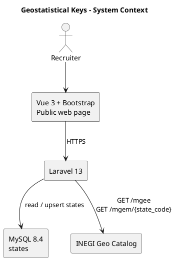
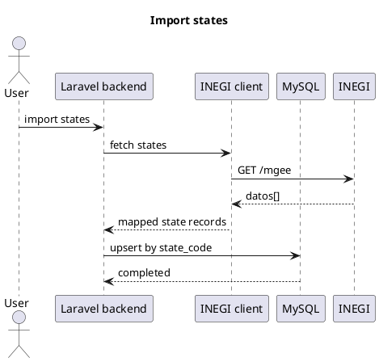
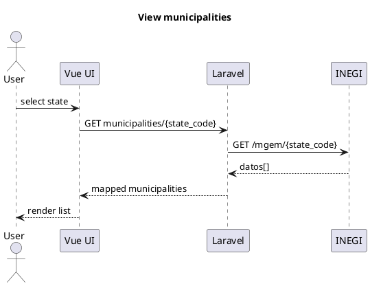

# Architecture

## Context

## Data boundary

`states` is the only persisted domain table in this version.

| Column | INEGI field | Constraint |
| --- | --- | --- |
| `state_code` | `cve_ent` | `char(2)`, unique; preserves leading zeroes |
| `name` | `nomgeo` | non-null |
| `total_population` | `pob_total` | unsigned integer, non-null |

Both INEGI endpoints return records in `datos`. Map only the fields above for states. For municipalities, return mapped `cve_ent`, `cve_mun`, `nomgeo`, and `pob_total`; do not persist the response or its metadata. If persistence is later needed, use the English plural `municipalities` table.

## Sequences

## Engineering decisions

- Keep one Laravel application and a single public Vue page.
- Use an INEGI client service, HTTP timeouts, and mapped responses to isolate the untrusted upstream API.
- Use a unique index and upsert so imports are idempotent.
- Whitelist sort fields and validate pagination/search inputs.
- Keep MySQL private in deployment and secrets out of Git.
